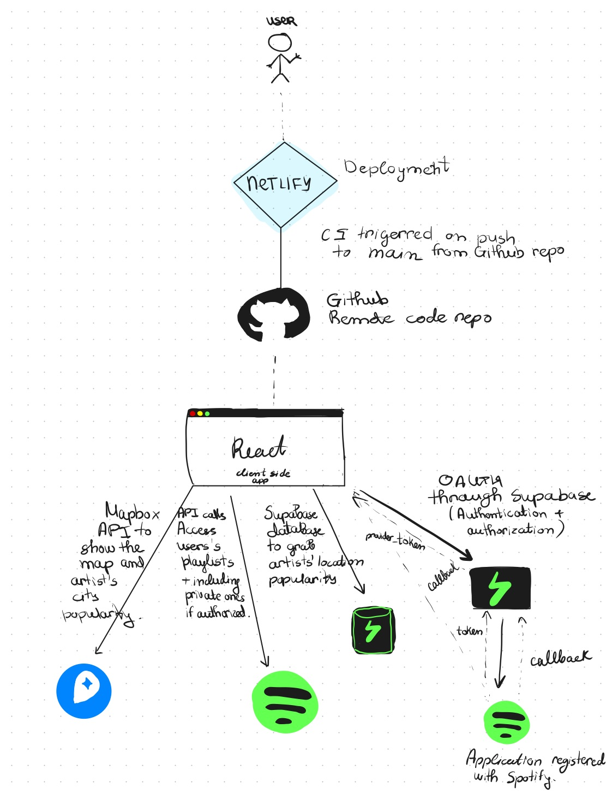

# Spodatify

[](https://app.netlify.com/sites/snazzy-liger-6fc261/deploys)

---
LINK: [SPODATIFY](https://snazzy-liger-6fc261.netlify.app/)


### Final Insturctions 
1. Please use these credentials to login.
    ```
    squeak_discs.0b@icloud.com
    Spotdatify123!
    ```
2. Click on `Get Playlists`.
3. Select any of the shown playlists.
4. Give it a few seconds...
5. TADA! Map!
6. To try another playlist refresh the page.

### What has been done and what needs improvement?
The application has been set up as a front-end client side React applicaion. It connects to Supabase which handles the OAuth to Spotify and provides back a token in order to communicate with the Spotify API. Movereover, additional options are added to authoraze certain access (to which the users is warned and agress on) such as profile and private playlists. After that the personal playlists are shown to the user and upon selecting one API calls are made to pull all the aritsts and compares to those in the database to get their current popularity in five cities. Those are accumulated in a geojson file and displayed after a few seconds to the use via the Mapbox API. The map displays a cluster of artists' popularity scaled as a percentage of a milion. (Usually an artist has a few thousands listeners in a city.) The legend of the cluster colors goest from the least to the most.  `pink ->  orange -> yellow -> green`.

As of improvement, the application definitely needs more data as it uses a very small set of artists. Also, the database is simple and consists of a single table which coordinates refer to the same city and causes repetitevness. A better solution is to have two tables and perform a join based on the city name. (I had issues doing joins with supabase). Also, I could not find a better way of displaying the popularity numbers. I initial had them show up on the map but it ruined the aesthetic. I great addition for that would be to add a chart with top 5 cities for an user and list the number of listeners there.

---
### What does your application do?
The application should allow an user to connect to their Spotify account and then pull their selected playlists with songs and in return get a map of people from cities which also have same interests in music as them based on the artists' top listeners location. 

### What makes it different than a CRUD app? I.e., what functionality does it provide that is not just a user interface layer on top of a database of user information, and the ability to view / add to / change that information?
The application will be able to OAuth Spotify users and use the sporitfy API to access data from their accounts. Moreover, an additional API will be used to pull a map and vizualize the data. As of now likely a database will be used with predefined popularity of artists since Spotify is not exposing that API. 

### What security and privacy concerns do you expect you (as developers) or your users to have with this application?
It is likely that users may have concernes of their data/playlists or prviate information form their accounts shared/exposed. 

### Architecture


### Developer
Mariya Pasheva (UIN: 679604082)